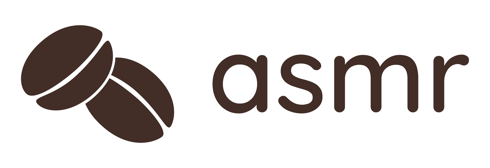
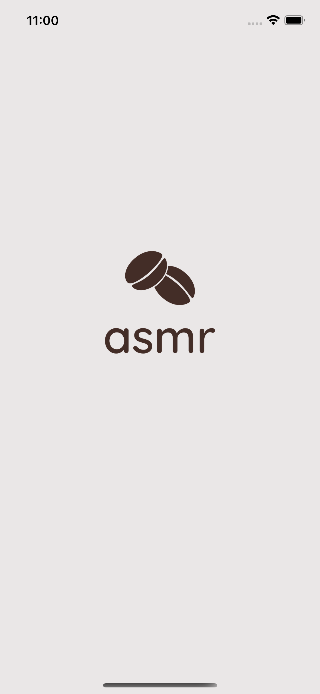
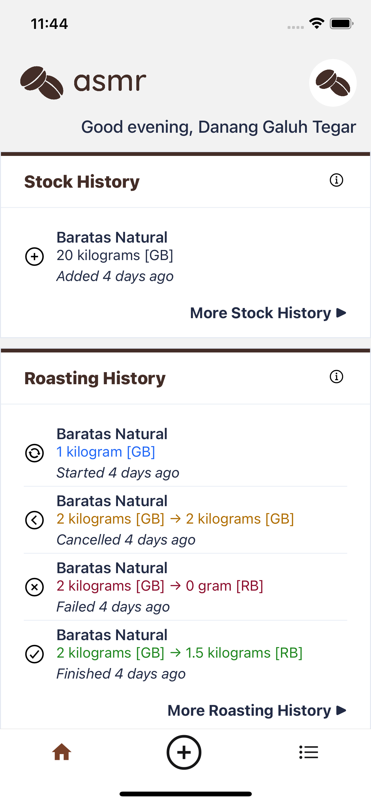
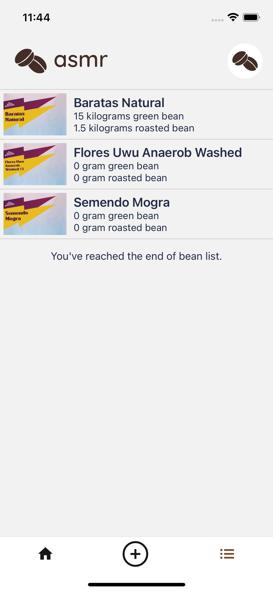

<!-- PROJECT SHIELDS -->
[![Contributors][contributors-shield]][contributors-url]
[![Forks][forks-shield]][forks-url]
[![Stargazers][stars-shield]][stars-url]
[![BSD 3-Clause License][license-shield]][license-url]

<!-- PROJECT LOGO -->
<br />
<div align="center">
  <a href="https://asmr.hamzahjundi.me/">
    
  </a>

<h3 align="center">asmr</h3>

  <p align="center">
    A simple Coffee Beans management solution on mobile!
  </p>
</div>


<!-- TABLE OF CONTENTS -->
<details>
  <summary>Table of Contents</summary>
  <ol>
    <li>
      <a href="#about-asmr-mobile">About asmr mobile</a>
      <ul>
        <li><a href="#built-with">Built With</a></li>
      </ul>
    </li>
    <li>
      <a href="#getting-started">Getting Started</a>
      <ul>
        <li><a href="#prerequisites">Prerequisites</a></li>
        <li><a href="#installation">Installation</a></li>
      </ul>
    </li>
    <li><a href="#usage">Usage</a></li>
    <li><a href="#license">License</a></li>
    <li><a href="#contact">Contact</a></li>
  </ol>
</details>


<!-- ABOUT ASMR MOBILE -->
## About asmr mobile

<div align="center">
  <a href="docs/launch-screen.png">
    
  </a>

  <a href="docs/home-screen.png">
    
  </a>

  <a href="docs/bean-list-screen.png">
    
  </a>
</div>

**asmr mobile** is your solution for coffee beans management on mobile phones. You can manage your bean inventory, track down green bean to roasted bean production, and manage roasted bean transaction. You can also see the production report to see how well your bean is being roasted.

To be able to access **asmr** on your workplace, you need to contact your workplace Administrator and provide the information about your employment information. The Administrator then will be able to register and grant you access to the system.

<p align="right">(<a href="#top">back to top</a>)</p>


### Built With

Powered by [React Native](https://reactnative.dev).

<p align="right">(<a href="#top">back to top</a>)</p>


<!-- GETTING STARTED -->
## Getting Started

To get a local copy up and running follow these simple example steps.

### Prerequisites

Please make sure have you following installed.
- [NodeJS 16 or newer](https://nodejs.org/)
- [Yarn Package Manager](https://classic.yarnpkg.com/)

### Installation

1. Clone this repo
   ```sh
   git clone https://github.com/danang-id/asmr-mobile.git
   cd asmr-mobile
   ```
2. Install NPM packages
   ```sh
   yarn install
   ```
3. _(Optional)_ Prepare Gleap Token. You can obtain it on the [Gleap Dashboard](https://app.gleap.io/dashboard). 
   Save this token to `.env.local` file. Use the following template if this file does not exist.
   ```dotenv
   GLEAP_TOKEN=""
   ```


<p align="right">(<a href="#top">back to top</a>)</p>


## Run and Build

To run this application for development, follow this guide documented by React Native team: 
[Running On Devices](https://reactnative.dev/docs/running-on-device).

To build this application for release, follow this guide documented by React Native team: 
[Publishing to Google Play Store](https://reactnative.dev/docs/signed-apk-android) or 
[Publishing to Apple App Store](https://reactnative.dev/docs/publishing-to-app-store).

<p align="right">(<a href="#top">back to top</a>)</p>


## License

This project is licensed under the BSD 3-Clause License. See [`LICENSE.md`](LICENSE.md) for more information.

<p align="right">(<a href="#top">back to top</a>)</p>


## Contact

Danang Galuh Tegar Prasetyo - [@dananggaluht](https://twitter.com/dananggaluht) - connect@danang.id

Project Link: [https://github.com/danang-id/asmr](https://github.com/danang-id/asmr)

<p align="right">(<a href="#top">back to top</a>)</p>


<!-- https://www.markdownguide.org/basic-syntax/#reference-style-links -->
[contributors-shield]: https://img.shields.io/github/contributors/danang-id/asmr-mobile.svg?style=for-the-badge
[contributors-url]: https://github.com/danang-id/asmr-mobile/graphs/contributors
[forks-shield]: https://img.shields.io/github/forks/danang-id/asmr-mobile.svg?style=for-the-badge
[forks-url]: https://github.com/danang-id/asmr-mobile/network/members
[stars-shield]: https://img.shields.io/github/stars/danang-id/asmr-mobile.svg?style=for-the-badge
[stars-url]: https://github.com/danang-id/asmr-mobile/stargazers
[license-shield]: https://img.shields.io/github/license/danang-id/asmr-mobile.svg?style=for-the-badge
[license-url]: https://github.com/danang-id/asmr-mobile/blob/master/LICENSE.md
[product-screenshot-launch]: docs/launch-screen.png
[product-screenshot-sign-in]: docs/sign-in-screen.png
[product-screenshot-home]: docs/home-screen.png
[product-screenshot-bean-list]: docs/bean-list-screen.png
[product-screenshot-profile]: docs/profile-screen.png
